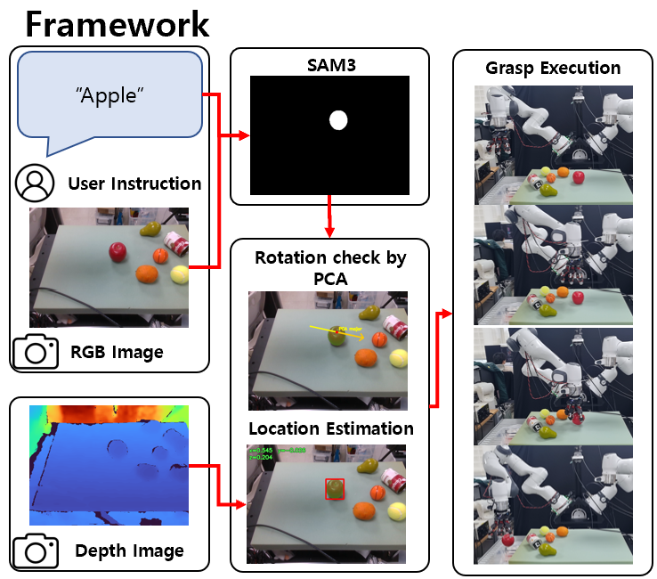

# Grasp_fruit

A fruit grasping and placing system using the KISTAR Franka FR3 + KISTAR Dexterous Hand.  
Captures RGB-D with a RealSense camera, detects the target object via SAM3 text-prompted segmentation,  
computes a top-down grasp pose, and executes the full pick-and-place autonomously.

Designed to work together with  
- [Franka_KISTAR_R_Exp_GWB](https://github.com/KIST-HARILAB/Franka_KISTAR_R_Exp_GWB)
- [Dex_ROS_GWB](https://github.com/KIST-HARILAB/Dex_ROS_GWB)

Made by **[Giwon Baek](https://github.com/BbaekGiwon)** (HARI LAB), 2026.06 



---

## System Overview

| Component | Details |
|---|---|
| Robot | KISTAR Franka FR3 + KISTAR Dexterous Hand |
| Camera | Intel RealSense D-series (RGB-D) |
| Software Stack | ROS2 Humble / MoveIt2 (Docker `ros2_humble`) |
| Pipeline Environment | Conda `pipeline_all` (Python 3.12, CUDA 12.8) |
| Vision Model | SAM3 (text-prompted instance segmentation) |
| Grasp Algorithm | Top-down grasp — PCA-based orientation + point cloud height |

---

## Installation

### 1. Conda Environment

```bash
cd HARILAB/Grasp_fruit
bash setup_pipeline_all.sh        # create env + install PyTorch (CUDA 12.8) + packages
conda activate pipeline_all
```

If the environment already exists:

```bash
bash setup_pipeline_all.sh --skip-conda
```

### 2. Docker Container

The `ros2_humble` container (ROS2 Humble + MoveIt2) must be running before executing Stage 3.

```bash
docker ps | grep ros2_humble
```

---

## Configuration Files

### `configs/paths.yaml` — Machine-specific paths

When cloning on a different machine, **only this file** needs to be updated.

```yaml
__CONDA_BASE__: /home/kist/miniforge3
__CONDA_ENV__:  pipeline_all
__DOCKER_CONTAINER__: ros2_humble
__ROS_DOMAIN_ID__:    9
__KISTAR_WS__:        /home/kist/HARILAB/dex_ros/isaac-ros/kistar_ws
__MOUNT_MAP__:
  - ["/home/kist/HARILAB", "/root/HARILAB"]
  - ["/home/kist/ros2_ws",  "/root/ros2_ws"]
```

### `configs/arm.yaml` — Robot arm parameters

| Parameter | Description |
|---|---|
| `home.joint_values` | HOME pose joint values (rad) |
| `approach_offset_m` | Approach start height above the object (m) |
| `place_z_descent_m` | Descent distance from HOME EE along world Z during place (m) |
| `grasp_z_offset_m` | Offset above SAM3 z_top to the actual grasp target (m, world Z) |
| `ee_correction.yaw_deg` | Hand mount rotation offset (°, world Z axis) |
| `ee_correction.x_offset_m` / `y_offset_m` | EE position correction (m, in EE frame — applied after yaw rotation) |
| `pointcloud.top_z_pct` | Top Z% of points used for centroid estimation |
| `pointcloud.z_top_pct` | Percentile for z_top estimation (outlier rejection) |

> **EE offset application order**: PCA computes the approach angle `alpha` first; `ee_correction.yaw_deg` is added to get the final yaw, and the x/y offset vector is rotated accordingly.  
> This means changing yaw also rotates the x/y displacement direction.

### `configs/fruits.yaml` — Per-object EE offset overrides

If the `--query` string (lowercased) matches an entry, it overrides the `arm.yaml` defaults.  
All fields are optional — missing fields fall back to `arm.yaml` values.

```yaml
pear:
  yaw_deg: -45.0
  x_offset_m:  0.01
  y_offset_m: -0.03
  grasp_z_offset_m: 0.13
```

Supported fields: `yaw_deg`, `x_offset_m`, `y_offset_m`, `grasp_z_offset_m`

### `configs/hand.yaml` — KISTAR hand poses

Defines grasp (`hand_grasp`), idle (`hand_init`), and release (`hand_release`) poses in degrees.  
Both `run_topdown_grasp.py` and `robot_executor.py` read from this file.

---

## Calibration

Calibration file: `configs/calibration/extrinsic_20260612_170053.json`

| Field | Description | Editable |
|---|---|---|
| `T_base_camera` | Hand-eye calibration result (camera → base transform) | **Do not modify** |
| `T_world_base` | Robot base mount position/orientation (world → base) | Freely editable |

### Updating T_world_base

When the robot base position changes, use `update_world_base.py` to recompute and write the matrix.

```bash
# Preview only (no file changes)
python scripts/update_world_base.py \
    --calib configs/calibration/extrinsic_20260612_170053.json \
    --x 0.066 --y -0.122 --z 0.099 \
    --roll_deg 45.0 --dry_run

# Apply
python scripts/update_world_base.py \
    --calib configs/calibration/extrinsic_20260612_170053.json \
    --x 0.066 --y -0.122 --z 0.099 \
    --roll_deg 45.0
```

---

## ROS2 Stack

MoveIt2 must be running in a separate terminal before starting the pipeline.

### 1. Allow X11 forwarding (for RViz GUI)

```bash
xhost +local:docker
```

### 2. Start the container

```bash
docker start ros2_humble
```

### 3. Launch MoveIt2

```bash
docker exec -it -e DISPLAY=$DISPLAY ros2_humble bash -c "
  unset PYTHONPATH PYTHONHOME CONDA_PREFIX CONDA_DEFAULT_ENV CONDA_PROMPT_MODIFIER
  export PATH=/usr/sbin:/usr/bin:/sbin:/bin:/opt/ros/humble/bin
  export ROS_DOMAIN_ID=9
  export RMW_IMPLEMENTATION=rmw_fastrtps_cpp
  export ROS_LOCALHOST_ONLY=0
  source /opt/ros/humble/setup.bash
  source /root/HARILAB/dex_ros/isaac-ros/kistar_ws/install/setup.bash
  ros2 launch franka_kistar_bringup fr3_interactive_pose_control.launch_GWB.py \
    gui:=true \
    use_fake_joint_states:=false \
    execute_mode:=direct_franka_topic \
    reference_frame:=base
"
```

Launch file location:
```
dex_ros/isaac-ros/kistar_ws/src/franka_kistar_bringup/launch/
    fr3_interactive_pose_control.launch_GWB.py
```

Once MoveIt2 is ready, the `/move_action`, `/compute_ik`, and `/compute_cartesian_path` action servers become active and Stage 3 of the pipeline can communicate with the robot.

> **Note**: If the container is not restarted after a previous session, two MoveGroup nodes may be running. See the Troubleshooting section if you see `/move_action unexpected result response` warnings.

---

## Usage

### Interactive Pipeline (Recommended)

Loads the SAM3 model once and accepts repeated text queries in a loop.  
The RealSense pipeline stays open for the entire session, so AE/AWB converges only once at startup.

```bash
conda activate pipeline_all
cd HARILAB/Grasp_fruit

# Vision only (no robot execution)
python scripts/run_pipeline_interactive.py \
    --calibration configs/calibration/extrinsic_20260612_170053.json

# Grasp
python scripts/run_pipeline_interactive.py \
    --calibration configs/calibration/extrinsic_20260612_170053.json \
    --execute_robot

# Pick + Place
python scripts/run_pipeline_interactive.py \
    --calibration configs/calibration/extrinsic_20260612_170053.json \
    --execute_robot --place

# Disable MoveIt collision checking (temporary, after robot base relocation)
python scripts/run_pipeline_interactive.py \
    --calibration configs/calibration/extrinsic_20260612_170053.json \
    --execute_robot --place --disable_collision
```

**Startup sequence:**

1. SAM3 model load
2. Prompt: "Record video? (yes/no)" — yes saves to `data/outputs/interactive_session.mp4`
3. RealSense pipeline start + warmup (60 frames, AE/AWB convergence)
4. Repeated `Query>` prompt — type `exit` / `quit` / `q` to stop

> When session recording is enabled (yes), the per-execution Docker recording prompt is automatically skipped.

### One-shot Pipeline

```bash
# Camera capture + Grasp
python scripts/run_pipeline.py \
    --capture \
    --query "apple" \
    --calibration configs/calibration/extrinsic_20260612_170053.json \
    --execute_robot

# Camera capture + Pick + Place
python scripts/run_pipeline.py \
    --capture \
    --query "apple" \
    --calibration configs/calibration/extrinsic_20260612_170053.json \
    --execute_robot --place

# Offline processing from saved NPZ (no robot)
python scripts/run_pipeline.py \
    --input data/raw/scene_000.npz \
    --query "apple" \
    --calibration configs/calibration/extrinsic_20260612_170053.json
```

### Common Options

| Option | Description | Default |
|---|---|---|
| `--calibration` | Path to calibration JSON | — |
| `--query` | SAM3 text query (e.g. `apple`) | — |
| `--execute_robot` | Enable robot execution | disabled |
| `--place` | Pick+Place mode (descent distance from `arm.yaml`) | disabled |
| `--speed_factor` | Robot speed scale factor | `0.1` |
| `--approach_offset` | Approach height offset (m) | `0.10` |
| `--z_offset` | Grasp Z offset (m); falls back to `arm.yaml` if unset | `arm.yaml` |
| `--disable_collision` | Disable MoveIt collision checking (temporary) | disabled |

---

## Pipeline Stages

```
Stage 0: RealSense capture    →  data/raw/<stem>_000.npz  (+  _rgb.png, _depth_vis.png)
Stage 1: SAM3 inference       →  data/interim/<stem>_mask.png  (+  _overlay.png)
Stage 2: Top-down grasp       →  data/outputs/<stem>_topdown_summary.json  (+  _overlay.png)
Stage 3: Robot execution      →  docker exec → robot_executor.py
```

### Stage 2 — Grasp Computation

1. Backproject masked point cloud → SOR filter to remove outliers
2. PCA on XY plane → major axis = grasp approach direction
3. Apply `arm.yaml` `ee_correction` + `fruits.yaml` overrides → EE orientation
4. z_top (upper percentile) + `grasp_z_offset_m` → EE height
5. Save summary JSON (`T_world_ee`, joint angles, hand encoder values)

### Stage 3 — Robot Execution Flow

**Grasp mode:**

```
HOME → Approach (approach_offset_m above object) → Descend (grasp position) → Close hand
→ Ascend (reverse of approach) → HOME
```

**Place mode (runs after grasp):**

```
(Grasp complete) → HOME → Descend vertically along world Z (place_z_descent_m) → Open hand
→ Ascend → HOME
```

> Place descent is computed in world Z. Even when `T_world_base` has a roll component, the motion stays vertical.

---

## Presentation Figure Generation

Generates two separate images from a `_topdown_summary.json` file.

```bash
python scripts/make_presentation_figs.py \
    data/outputs/interactive_012_012_topdown_summary.json
```

Outputs:
- `*_fig_pca.png` — mask overlay + PCA major axis arrow
- `*_fig_position.png` — mask overlay + SAM3 detection bbox + grasp position coordinates (top-left)

---

## Directory Structure

```
Grasp_fruit/
├── configs/
│   ├── arm.yaml                     # Robot arm parameters (HOME pose, offsets, etc.)
│   ├── hand.yaml                    # Hand pose parameters
│   ├── fruits.yaml                  # Per-object EE offset overrides
│   ├── paths.yaml                   # Machine-specific path settings
│   ├── calibration/                 # Calibration JSON files
│   └── camera/
│       └── realsense.yaml           # RealSense resolution / FPS settings
│
├── scripts/
│   ├── run_pipeline_interactive.py  # Interactive pipeline (recommended)
│   ├── run_pipeline.py              # One-shot pipeline
│   ├── pipeline_core.py             # Shared stage functions / argparse builders
│   ├── robot_executor.py            # Robot execution entry point (runs inside Docker)
│   ├── send_to_robot.py             # Host → Docker exec bridge
│   ├── run_topdown_grasp.py         # Top-down grasp computation (Stage 2)
│   ├── run_sam3_only_stage.py       # SAM3 inference subprocess (Stage 1)
│   ├── capture_realsense_once.py    # Single RealSense capture (Stage 0)
│   ├── make_presentation_figs.py    # Presentation figure generation
│   ├── update_world_base.py         # T_world_base update utility
│   ├── launch_moveit.py             # MoveIt launch helper
│   ├── docker_runner.py             # Docker exec / video recording utilities
│   └── utils/
│       ├── arm.py                   # arm.yaml parser and constant exports
│       ├── hand.py                  # hand.yaml parser and constant exports
│       ├── paths.py                 # paths.yaml parser
│       ├── grasp.py                 # GraspExecutor (ROS2 Node)
│       ├── place.py                 # PlaceExecutor (extends GraspExecutor)
│       └── step.py                  # Atomic step functions (move_home, approach, …)
│
├── src/
│   └── affordance_grasp/
│       ├── io/
│       │   ├── dataset_io.py        # NPZ save/load, JSON utilities
│       │   └── realsense.py         # RealSense capture / RealSenseSession
│       └── geometry/
│           └── frame_transform.py   # Transform matrix utilities (xyzrpy, invert, etc.)
│
├── data/
│   ├── raw/                         # RealSense capture NPZ + PNG
│   ├── interim/                     # SAM3 masks, overlays
│   └── outputs/                     # Grasp summary JSON, overlays, session.mp4
│
├── docker/
│   ├── Dockerfile.moveit
│   └── entrypoint_moveit.sh
│
├── environment_pipeline_all.yml     # Conda environment definition
└── setup_pipeline_all.sh            # Environment setup script
```

---

## Troubleshooting

### IK failure (code=-31)

Occurs when the MoveIt collision scene does not match the current robot base position.

- Temporary fix: use `--disable_collision`
- Proper fix: update the collision object positions in the RViz Planning Scene to match the new base location

### `depth_vis.png` is entirely blue

This was caused by a fixed `alpha` scaling. The current code uses per-frame min-max normalization with the TURBO colormap and should not produce this issue. If it occurs, check the `make_depth_vis` function in `src/affordance_grasp/io/realsense.py`.

### RealSense images are blurry

Capturing immediately after starting the pipeline produces blurry images because AE/AWB has not converged yet.  
The interactive pipeline (`run_pipeline_interactive.py`) keeps the RealSense pipeline alive throughout the session via `RealSenseSession`, so only the initial warmup (60 frames) is needed.  
For the one-shot pipeline, adjust the warmup length with `--warmup_frames`.

### Two action servers on `/move_action`

```
[WARN] Ignoring unexpected result response. There may be more than one action server for the action '/move_action'
```

Two MoveGroup nodes are running inside the container — typically caused by a previous session not shutting down cleanly.

```bash
# Inside the container
ros2 node list | grep move_group
kill $(ps aux | grep move_group | grep -v grep | awk '{print $2}')
```

### Place descends along base Z instead of world Z

`step_place_from_home` could not find `T_world_base`. Check that the summary JSON contains the `T_world_base` field and that the calibration JSON has the corresponding entry.
